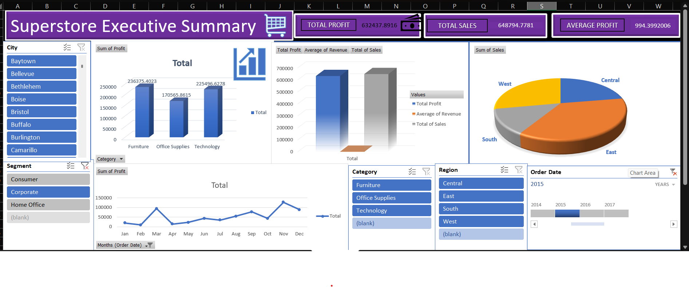

# Excel Project Dashboard

Welcome to the **Excel Project Dashboard** – a visual and analytical tool built using Microsoft Excel to explore and present data insights effectively.

---

## 🖼️ Dashboard Preview

Here is a preview of the main dashboard from this project:

---

## 📂 Project Structure

- `Excel_Project.xlsx` — The Excel workbook containing the dashboard, data, charts, and calculations.

---

## 🔍 Purpose & Features

This Excel dashboard project is designed to:

- Consolidate raw data for meaningful analysis  
- Provide interactive visualizations (charts, tables, KPIs)  
- Track and display key metrics clearly  
- Help users make data-driven decisions  

### Key features included:
1. **KPI Tiles** — Highlight important business metrics at a glance  
2. **Trend Charts** — Line charts to show how metrics evolve over time  
3. **Category Breakdown** — Pie/bar charts to break down performance by category  
4. **Dynamic Filtering** — Drop-down filters or slicers to drill down into specific data segments  

---

## ⚙️ How to Use

1. **Open the Workbook**  
   Launch `Excel_Project.xlsx` in Microsoft Excel (preferably a modern version that supports slicers and dynamic charts).

2. **Enable Content**  
   If Excel prompts for permissions, click **Enable Editing** / **Enable Content** so that macros or pivot tables (if any) work properly.

3. **Explore the Dashboard**  
   - Use slicers / filters to change views  
   - Navigate between sheets (Dashboard, Data, Raw Data)

4. **Update the Data**  
   - Go to the Data sheet and input or paste new data  
   - Refresh pivot tables or charts to update visuals  

5. **Save Your Changes**  
   Export charts or dashboards as images if needed.

---

## 📈 Use Cases

- Business performance tracking (sales, operations, marketing)  
- Monthly / quarterly reporting  
- Data analysis for small teams  
- Educational / academic project to practice Excel dashboard creation  

---

## 👤 Author

**Kamal Sandeep**  
GitHub: [kamalsandeep1501](https://github.com/kamalsandeep1501)

---

## 💡 Next Steps

- Add advanced Excel features like **Power Query** or **Power Pivot**  
- Convert the dashboard into a **Power BI** version  
- Add a documentation sheet explaining data sources & assumptions  

---

## 📥 How to Clone This Repository

You can clone this project using the following command:

git clone[Excel_Project] (https://github.com/kamalsandeep1501/Excel_Project.git)
